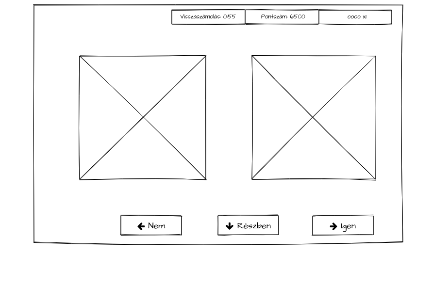

# Egyszerű játék XAML alapokon

## Áttekintés
A játék egy egyszerű ***desktop*** alkalmazás (fontos döntés!) ami méri és így segít fejleszteni a reakcióidőnket. A játék lényege, hogy kártyákat mutatunk egymás után, és minden alkalommal el kell dönteni, hogy az adott kártya egyforma-e az előzővel.

## Szereplők
- Tudom Ányos

  A szellemi képességeinek a növekesét kívánja nyomon követni.

  Mivel az egyes reakcióidők és a játékidő hosszának mérése fontos, ezeket pontosan kell mérni, adja magát a számítógépes megvalósítás.

## Forgatókönyvek
- Játék
  
  Ányos elindítja az alkalmazást (fontos döntés!), majd, ha felkészült, akkor elindítja a játékot. Ha végzett, akkor a végeredményt a játék kijelzi.

  Mivel rövid reakcióidőt mérünk, ezért az alkalmazás indításának idejére nem használhatjuk a játékot. Ezért az alkalmazás indítása és a játék elkezdése között különbséget kell tenni.

  Hány képernyő legyen?

  Egy és három között valahol:

  - alkalmazás induló képernyője 
  
    mindkét kártya lefordítva ezt megoldja

  - játék képernyő
  - végeredmény képernyő 
  
    mindkét kártya lefordítva megoldja, mert az eredményt folyamatosan kijelezzük

Kezdetben elindulhatunk úgy, hogy a játék kezdőképernyője egyben az alkalmazás induló képernyője. És, a játék utolsó képernyője az a végeredmény képernyője.

  Fontos, hogy a lényeg a reakcióidő mérése, így nem gombokra hanem billentyűleütésekre tesszük a játékos reakcióit. Viszont, érdemes megjeleníteni játék közben a lehetőségeket, erre jók lesznek a gombok.

Játék közben vagy eltaláljuk a helyes választ, vagy nem. Ha eltaláljuk, azt a képernyőn például zöld pipával tudjuk jelezni.
Ha nem találjuk el a helyes választ, akkor lehet piros kereszt, vagy az előző kártyalap megmutatásával a felhasználónak jelezni lehet a hibás választ.

